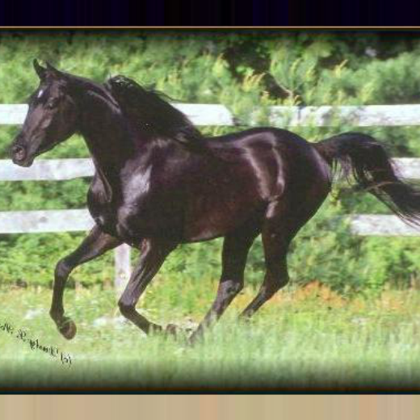
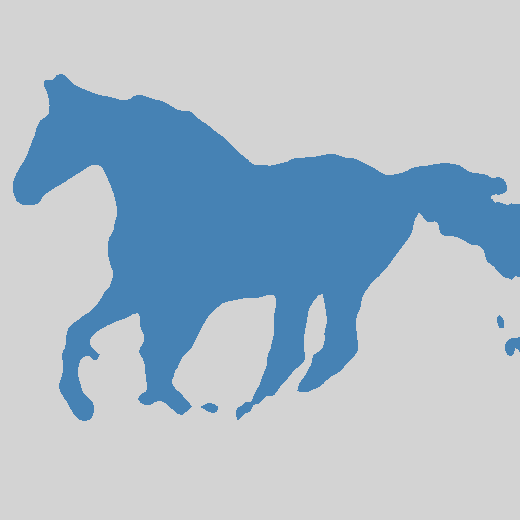
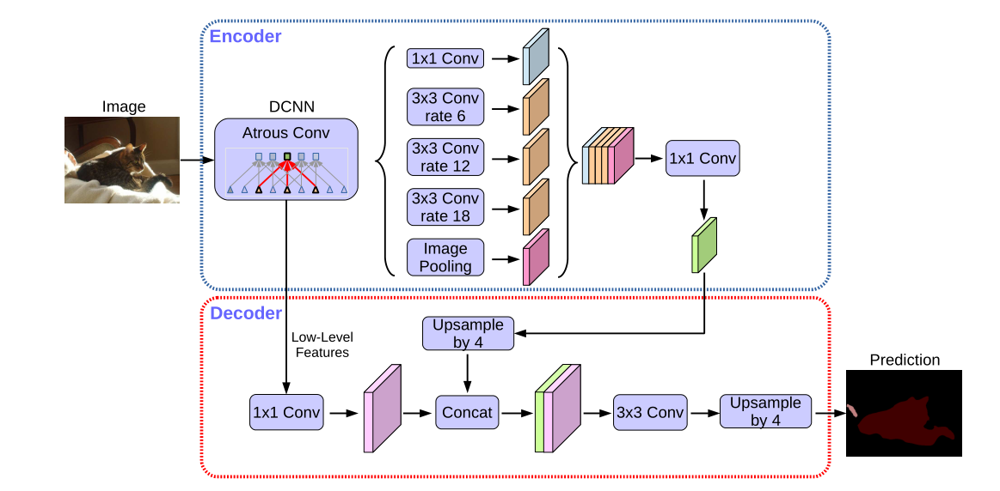

# DeepLabV3+

<p align="center">
  
  
</p>

## 介绍
该repository为对google在2018年提出的语义分割模型DeepLabv3+的pytorch实现及相关实验。
- 原论文：**[Encoder-decoder with atrous separable convolution for semantic image segmentation](https://arxiv.org/abs/1802.02611v3)**
- 网络结构：


## 环境配置：
* Python3.8
* Pytorch1.10
* Windows
* 最好使用GPU训练
* 详细环境配置见```requirements.txt```
## 文件结构：
```
  ├── image: 存放图片
  |   ├──train_val: 用于训练和验证的数据集
  |   |  ├──train：训练数据集（277张）
  |   |  └──val：验证数据集（50张）
  |   └──demo：用于测试模型效果的图片
  ├── model: 模型的子模块及DeepLabv3+的搭建
  |   ├──ASPP.py
  |   ├──decoder.py
  |   ├──deeplab_model.py
  |   └──xception.py：用于测试模型效果的图片
  ├── result: 记录模型训练及验证过程中的损失及评价指标的文本文件
  ├── runs: 存放tensorboard的log文件
  ├── dataset.py: 数据载入及对其进行预处理
  ├── demo.py: 简易的预测脚本，使用训练好的权重进行预测
  ├── evaluation_index.py: 计算评价指标PA，mIoU，Boundary IoU
  └── train.py：训练和验证
```
## 数据集
- 实验采用的数据集为Weizmann Horse数据集，其已经被划分为训练集和验证集并存放在项目的image/train_val文件夹中，无需再下载
- 如果采用自己的数据集，请按照`image/train_val`文件夹中的数据集的存放方式，并设置好训练脚本的`--data-path`

## 预训练模型
该DeepLabv3+模型已在Weizmann Horse数据集上训练，其性能模型在验证集上的指标如下所示，模型权重文件已经上传到百度网盘。
| PA in val | mIoU in val    |Boundary IoU in val|预训练模型|
| :-------- | :------------: |:---------: |:--------------:|
| 94.9%  | 87.6%          | 57.1%     | [百度网盘](https://pan.baidu.com/s/1GyLF2LBzQL-tY6v3GlM2mw?pwd=op76) |

## 训练
执行以下命令进行训练过程：

    python train.py

请注意：
- 如果需使用预训练模型，请将pth文件下载到`weights/best_weights`文件夹内
- 如果采用自己的数据集，请参考`image/train_val`文件夹中的数据集的存放方式，且`--data-path`应修改为您的数据集目录

## 预测
利用实验数据集训练的模型的预测效果图位于`image/demo`文件夹中，`horse`和`mask`文件夹存放图片和分割图，`horse_pretreatment`和`mask_pretreatment`文件夹则存放经预处理后的图片和分割图。`outputs`文件夹存放预测的分割图。

执行以下命令进行预测过程：

    python demo.py

请注意：
- 确保`weights/best_weights`文件夹内有权重文件，无论是下载预训练模型还是先进行训练
- 如果采用自己的数据集，请参考`image/demo`文件夹中的数据集的存放方式，且`root_path`应修改为您的数据集目录


